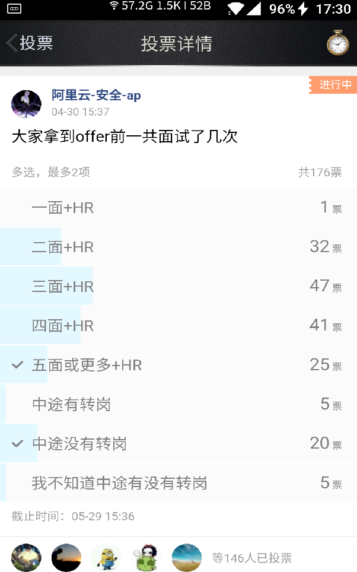

# 阿里巴巴

## 阿里春招面试有关的FAQ

1. 在阿里巴巴春招(实习生)中, 我会被面试几轮? 面试轮数越多越好吗?
    > 技术岗面试流程一般是 技术面+HR面
      偶尔在HR面后还会有技术面

    > 先看一个图, 是2017年(18届)阿里非官方Offer群里的一个投票.
      
      可以发现面试轮数呈正态分布.
      请注意! 这里统计的都是 **拿到阿里offer的同学** 不包括没有拿到阿里offer的.
      按照ap自己不靠谱的小样本, 不转岗走到4面或者更多的基本是稳的.

    > 一般来说, 评级高的人面试轮数也多. 面试轮数多的评级高的可能性也大。  
      这也是很好理解的，因为你厉害，所以公司在你身上消耗了更多的面试资源。
      一句话, 按经验来说:  面得越多, 你越吊。

2. 什么是阿里的交叉面? 哪些人有交叉面?
    > 交叉面就是跨BU面.  (ps: BU指阿里的事业群, 具体看这里 https://campus.alibaba.com/trems.htm)
      就比如说你投的是淘宝, 然后天猫的人来面试你, 就是交叉面  
      一般来说, 厉害的同学才有交叉面；具体来说, 是评级在A及以上的同学  
      (据说是)为了避免部门内部恶意操纵评级。  
      <此句非常主观> 根据我的观察，交叉面刷人比较少，能走到交叉面，一般都能过。

    > 有些面试官会主动说这轮是交叉面， 更多时候还是要自己问。
      <此句非常主观> 按道理来说交叉面的面试官不会和自己的部门隔得太远。比如一个安全的, 不会前端的来面你。  
      但也有例外， 有同学遇到过方向完全不一样的交叉面。

    > 一般是本部门的面试结束后进行一轮交叉面， 交叉面也是技术面，一般在HR面之前。

3. 技术面过程中状态变成"已回绝"，但马上又出现另一个面试状态条， 为什么?
    > 有几种可能性:
    > 1. 你水平不错, 但是不适合本部门, 帮你转到别的部门了
    > 2. 你被该部门刷了, 但是被另一个部门从简历池里捞起来了
    > 3. 如果有的话欢迎补充

4. 为什么"更换职位"或者"更换城市"按钮变灰? 发生了什么?
    > 首先恭喜, 这是好事
      说明你的简历(或者面试)不错，已经被部门锁定，通过概率plus
      如果你是定向内推的，那么"更换职位"按钮可能一开始就是灰的
